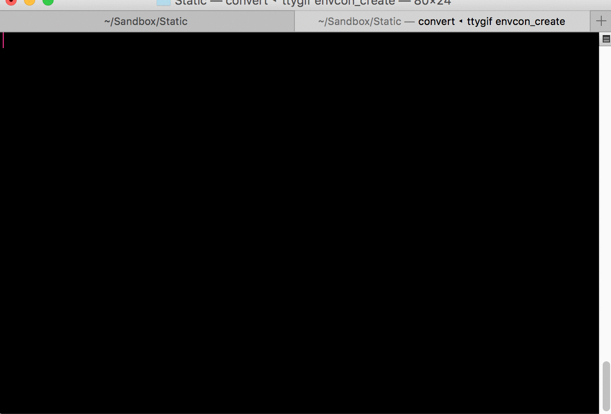
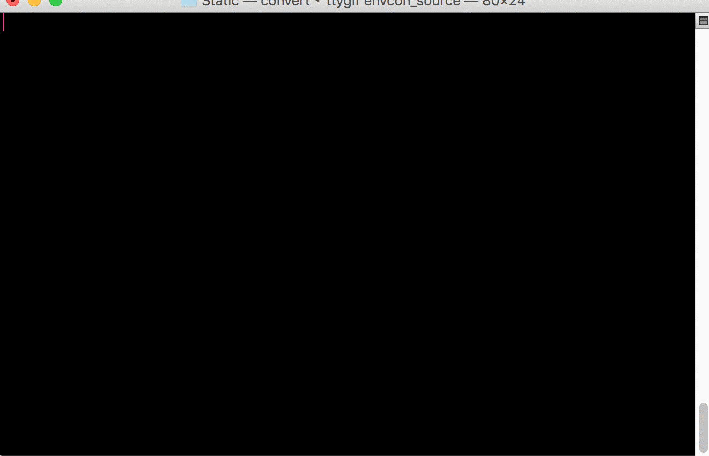
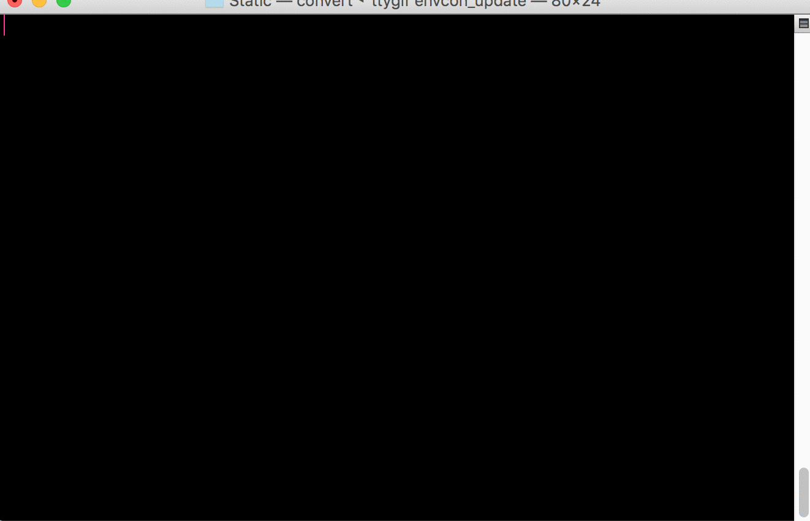
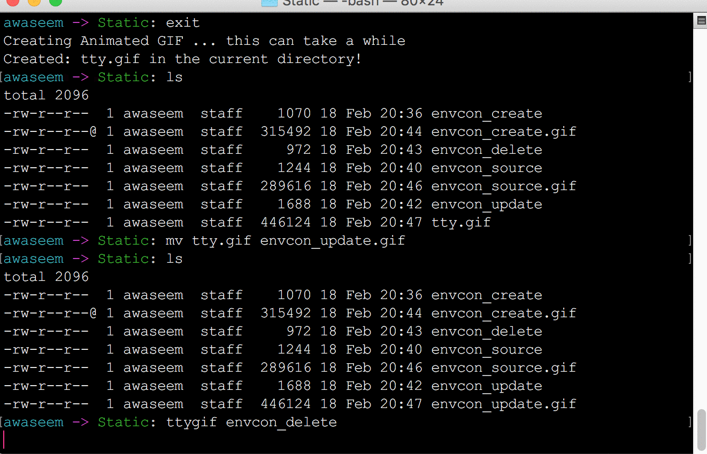

<pre>
   _____  ___   ___________  _  __
  / __/ |/ / | / / ___/ __ \/ |/ /
 / _//    /| |/ / /__/ /_/ /    / 
/___/_/|_/ |___/\___/\____/_/|_/
</pre>

# ENVCON

Separate enviroment variable dependencies without polluting your local enviroment workspace.
Idea is to keep each applications enviroment variables as separate containers, think of `virtualenv` for enviroment variables.

# Install

Currently supported on OSX only. Download the binary [here](https://github.com/awaseem/envcon/releases)

## Commands

### create
create a new container with enviroment variables, you can also encrypt the contents.

### source
create a new process with all the variables sourced.

### update
update enviroment variable keys

### delete 
delete a container

## TODO

- Tests for Commands
- Test support for linux
- Add support for Windows